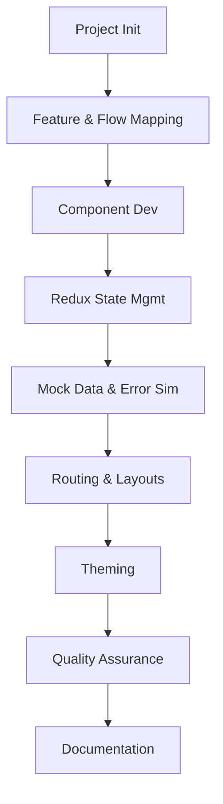

# 🤖 Automated Prompts for Copilot Agent: MIT-Grade Architecture

## 1. 🎯 Objective

Automate the workflow for Copilot agent in frontend development using open source stack:  
**ReactJS**, **Redux Toolkit**, **TypeScript**, **Material-UI (MUI)**, and **Atomic Design**.

---

## 2. 🏗️ Structured Prompt Automation Blueprint

### a. **Project Initialization**
- Prompt:  
  - Initialize repository with strict TypeScript, ESLint, Prettier, Jest, Storybook, and Vite.
  - Scaffold atomic directory structure: Atoms, Molecules, Organisms, Templates, Pages.
  - Document project setup in README.md.

### b. **Feature & Flow Mapping**
- Prompt:  
  - List all business domains and user journeys.
  - Document pages and flows per domain, including edge cases.
  - Map Redux slices required for each feature.

### c. **Component Development**
- Prompt:  
  - For every atomic component, generate:
    - Typed implementation
    - Unit test
    - Storybook story
    - Accessibility notes
    - Usage documentation
  - Ensure maximal reusability and cross-feature coverage.

### d. **Redux State Management**
- Prompt:  
  - Scaffold Redux slices, selectors, and RTK Query endpoints per domain.
  - Simulate all state scenarios: loading, error, empty, success.
  - Integrate with mock data for rapid prototyping.

### e. **Mock Data & Error Simulation**
- Prompt:  
  - Use Faker.js/MSW to generate functional mock data for every API and slice.
  - Simulate error, edge case, and latency for all flows.
  - Document mock scenarios for reproducible testing.

### f. **Routing & Layouts**
- Prompt:  
  - Define all routes, guarded and public, using React Router.
  - Scaffold templates for layouts: Auth, Dashboard, Public, Error.
  - Automate route documentation and flow charts.

### g. **Theming & Customization**
- Prompt:  
  - Generate MUI theme configuration: palette, typography, breakpoints, dark mode.
  - Document theme usage and customization patterns.
  - Automate style testing (visual regression).

### h. **Quality Assurance**
- Prompt:  
  - Automate linting, formatting, and testing pipelines.
  - Document accessibility and performance best practices.
  - Generate checklists for contributors.

### i. **Documentation**
- Prompt:  
  - Autogenerate component and API documentation using JSDoc/Storybook/Markdown.
  - Map onboarding guides and architecture diagrams.
  - Maintain CHANGELOG.md for transparency.

---

## 3. 📐 Automated Prompt Chaining (Mermaid Diagram)

---

## 4. 📝 Usage Instructions

- Feed each section as a prompt to Copilot agent in sequence for fully automated project scaffolding.
- Each prompt ensures strict adherence to architectural, market, and open source best practices.
- No manual intervention required for setup, development, or documentation.

---

## 5. ✅ MIT-Grade Checklist for Automated Copilot Prompts

- [x] Initialization and directory structure automated
- [x] Business flows and edge cases documented up front
- [x] Atomic components generated with tests and docs
- [x] Redux state and API mocks scaffolded per domain
- [x] Routing, theming, and layouts automated
- [x] Quality and accessibility enforced
- [x] Full documentation auto-generated

---