```mermaid
graph TD
    A[Authentication]
    B[Dashboard]
    C[User Management]
    D[Product Management]
    E[Settings]
    F[Profile]
    G[Reports & Analytics]
    H[Notifications]
    I[Integrations]
    J[Audit Log]
    K[Help Center]
    L[Error Handling]
    M[Billing & Subscription]
    N[Multi-Tenancy]
    O[Activity Feed]

    A --> A1[Login]
    A --> A2[Register]
    A --> A3[Forgot Password]
    A --> A4[MFA]
    A --> A5[SSO]

    B --> B1[Dashboard]
    B --> B2[Analytics Overview]
    B --> B3[Custom Widgets]

    C --> C1[Users List]
    C --> C2[User Details]
    C --> C3[Edit User]
    C --> C4[Roles]

    D --> D1[Products]
    D --> D2[Product Detail]
    D --> D3[Create/Edit Product]

    E --> E1[General]
    E --> E2[Preferences]
    E --> E3[Notifications]
    E --> E4[Security]

    F --> F1[Profile View]
    F --> F2[Edit Profile]
    F --> F3[Avatar Upload]

    G --> G1[Reports]
    G --> G2[Analytics Builder]
    G --> G3[Export]
    G --> G4[Trends]

    H --> H1[Inbox]
    H --> H2[Alerts]
    H --> H3[Messages]
    H --> H4[Action Center]

    I --> I1[Integrations]
    I --> I2[Add Integration]
    I --> I3[Edit Settings]

    J --> J1[Audit Log]
    J --> J2[Log Detail]

    K --> K1[Help Center]
    K --> K2[FAQ]
    K --> K3[Contact Support]
    K --> K4[Guides]

    L --> L1[NotFound]
    L --> L2[Error]
    L --> L3[Maintenance]
    L --> L4[Permission Denied]

    M --> M1[Plans]
    M --> M2[Payment Methods]
    M --> M3[Invoices]
    M --> M4[History]

    N --> N1[Tenant List]
    N --> N2[Tenant Details]
    N --> N3[Switch Tenant]

    O --> O1[Activity Stream]
    O --> O2[Notifications]
```

# 🧠 MIT-Level Structured Mapping: Extensive Feature Pages & Component Flows

## 1. 🎯 Strategic Objective

- Deliver a scalable, maintainable, and enterprise-ready frontend architecture.
- Map every feature page and its internal flows/component hierarchy.
- Enable rapid onboarding and seamless collaboration for development teams.
- Anticipate business growth, evolving requirements, and integration needs.

---

## 2. 🗂️ Feature Pages: Exhaustive Catalog

| Feature Area        | Pages Included                                | Business Purpose                                                         |
|---------------------|-----------------------------------------------|--------------------------------------------------------------------------|
| Authentication      | Login, Register, Forgot Password, MFA, SSO    | User onboarding, access control, compliance                              |
| Dashboard           | Dashboard, Analytics Overview, Custom Widgets | Real-time insights, KPIs, business health, operational monitoring        |
| User Management     | Users List, User Details, Edit User, Roles    | Employee/customer management, access rights, lifecycle management        |
| Product Management  | Products, Product Detail, Create/Edit Product | Catalog management, inventory, product lifecycle                         |
| Settings            | General, Preferences, Notifications, Security | Personalization, system config, alerting, privacy controls               |
| Profile             | Profile View, Edit Profile, Avatar Upload     | User self-service, engagement, activity timeline                         |
| Reports & Analytics | Reports, Analytics Builder, Export, Trends    | Business intelligence, custom analytics, exporting, trend tracking       |
| Notifications       | Inbox, Alerts, Messages, Action Center        | Timely communication, user action prompts, system alerts                 |
| Integrations        | Integrations, Add Integration, Edit Settings  | Connect external systems, API management, partner ecosystem              |
| Audit Log           | Audit Log, Log Detail                         | Compliance, traceability, security audits                                |
| Help Center         | Help Center, FAQ, Contact Support, Guides     | Customer support, documentation, onboarding help                         |
| Error Handling      | NotFound, Error, Maintenance, Permission Denied | Robust UX for failures, outages, permission issues                       |
| Billing & Subscription | Plans, Payment Methods, Invoices, History  | Monetization, account management, compliance                             |
| Multi-Tenancy       | Tenant List, Tenant Details, Switch Tenant    | SaaS support, organization management, data isolation                    |
| Activity Feed       | Activity Stream, Notifications                | Engagement, transparency, audit trails                                   |

---

## 3. 🧩 Atomic Component Flows per Page

### Authentication

- **Login**
  - Atoms: Input, Button, Typography, Loader, ErrorBadge
  - Molecules: FormField, PasswordInput, RememberMeCheckbox
  - Organisms: LoginForm, SocialLogin, MFAForm
  - Templates: AuthLayout
  - Flow: Enter credentials → Submit → Loading → MFA → Error → SSO Option → Redirect

- **Register**
  - Atoms: Input, Button, Checkbox, Tooltip
  - Molecules: FormField, TermsCheckbox
  - Organisms: RegisterForm, InviteForm
  - Templates: AuthLayout
  - Flow: Fill details → Validate → Accept Terms → Submit → Confirmation → Redirect

- **Forgot Password**
  - Atoms: Input, Button, Typography
  - Molecules: FormField
  - Organisms: ForgotPasswordForm
  - Templates: AuthLayout
  - Flow: Enter email → Submit → Email sent → Confirm → Back to Login

- **MFA / SSO**
  - Atoms: Input, Button, QRCode
  - Molecules: CodeInput, ProviderList
  - Organisms: MFAForm, SSOButtons
  - Flow: Setup MFA → Enter code → Validate → Success/Error

---

### Dashboard

- **Dashboard**
  - Atoms: Card, Typography, Button, Icon, Chip, ChartLegend
  - Molecules: StatsWidget, ActivityItem, KPIBlock
  - Organisms: Header, Sidebar, DataTable, ChartWidget, NotificationDrawer
  - Templates: DashboardLayout
  - Flow: Load metrics → Interact with widgets → Drill down → Export → Custom dashboard

- **Analytics Overview**
  - Atoms: DatePicker, Button, Tooltip
  - Molecules: FilterBar, ChartCard
  - Organisms: AnalyticsTable, ChartWidget
  - Flow: Select date range → Filter → Visualize → Export

---

### User Management

- **Users List**
  - Atoms: SearchInput, Button, Avatar, Badge
  - Molecules: SearchBar, UserCard, StatusTag
  - Organisms: UserTable, Pagination, BulkActions
  - Templates: DashboardLayout
  - Flow: List users → Search/filter/sort → Bulk actions → Select user

- **User Details / Edit**
  - Atoms: Input, Button, Badge, Switch
  - Molecules: FormField, RoleSelector, StatusToggle
  - Organisms: EditUserForm, ActivityLog, PermissionsPanel
  - Flow: View profile → Edit info/roles → Manage permissions → Save changes → Error/Success

---

### Product Management

- **Products Page**
  - Atoms: SearchInput, Button, Chip, Badge
  - Molecules: ProductCard, FilterBar, TagSelector
  - Organisms: ProductTable, Pagination, BulkActions
  - Flow: List products → Filter → Select product → Bulk update → Export

- **Product Detail**
  - Atoms: Input, Button, ImageUploader
  - Molecules: FormField, PriceInput, TagSelector
  - Organisms: EditProductForm, RelatedProducts
  - Flow: View/edit product → Manage tags/images → Save changes → Error/Success

---

### Settings

- **General Settings**
  - Atoms: Switch, Button, Typography, Dropdown
  - Molecules: SettingsField, NotificationToggle
  - Organisms: SettingsForm, SecurityPanel
  - Templates: DashboardLayout
  - Flow: Change preferences → Save/cancel → Error/Success

- **Security Settings**
  - Atoms: Input, Button, Badge
  - Molecules: PasswordField, MFASetup
  - Organisms: SecurityForm, AuditPanel
  - Flow: Update password → Setup MFA → Review audit → Save

---

### Profile

- **Profile View/Edit**
  - Atoms: Avatar, Input, Button, Badge
  - Molecules: FormField, ProfileCard, StatusTag
  - Organisms: EditProfileForm, ActivityWidget
  - Flow: View details → Edit info → Upload avatar → Save → Timeline

---

### Reports & Analytics

- **Reports**
  - Atoms: DatePicker, Button, Typography, Loader
  - Molecules: FilterBar, ChartCard
  - Organisms: DataTable, ChartWidget, ExportPanel
  - Flow: Select parameters → Filter → Visualize → Drill down → Export

---

### Notifications

- **Inbox / Alerts**
  - Atoms: Icon, Badge, Button, Chip
  - Molecules: NotificationItem, AlertCard
  - Organisms: NotificationList, ActionCenter
  - Flow: View alerts → Mark as read → Take action → Bulk dismiss

---

### Integrations

- **Integrations List/Detail**
  - Atoms: Icon, Button, Typography
  - Molecules: IntegrationCard, ProviderList
  - Organisms: IntegrationList, AddIntegrationForm, EditIntegrationForm
  - Flow: List integrations → Connect/disconnect → Configure → Save → Error/Success

---

### Audit Log

- **Audit Log**
  - Atoms: Typography, Badge, DatePicker
  - Molecules: AuditLogItem, FilterBar
  - Organisms: AuditLogTable, LogDetailModal
  - Flow: View logs → Filter by date/user/action → Drill down → Export

---

### Help Center

- **Help Center / FAQ / Guides**
  - Atoms: SearchInput, Typography, Button
  - Molecules: FAQItem, GuideCard
  - Organisms: FAQList, ContactForm, SupportPanel
  - Flow: Search help topics → Read answers → Contact support → Submit ticket

---

### Error Handling

- **NotFound / Error / Maintenance / Permission Denied**
  - Atoms: Typography, Button, Icon
  - Molecules: ErrorMessage, GoHomeButton
  - Organisms: ErrorPage, MaintenanceBanner
  - Templates: ErrorLayout
  - Flow: Display error → Suggest navigation → Retry/Redirect

---

### Billing & Subscription

- **Plans / Payment / Invoices**
  - Atoms: Card, Button, Badge, Input
  - Molecules: PaymentField, PlanSelector
  - Organisms: BillingForm, InvoiceTable, HistoryPanel
  - Flow: View plans → Select → Enter payment → Confirm → View invoices

---

### Multi-Tenancy

- **Tenant List / Switch / Details**
  - Atoms: Input, Button, Badge
  - Molecules: TenantCard, SwitchTenantButton
  - Organisms: TenantTable, TenantDetailPanel
  - Flow: List tenants → Switch → Manage → View isolation status

---

### Activity Feed

- **Activity Stream / Notifications**
  - Atoms: Icon, Badge, Button
  - Molecules: ActivityItem, FilterBar
  - Organisms: ActivityStream, NotificationPanel
  - Flow: View activity → Filter → Drill down → Mark as read

---

## 4. 🔄 Edge Case & Alternate Flow Mapping

| Feature        | Edge Cases / Alternate Flows                                       |
|----------------|--------------------------------------------------------------------|
| Auth           | Expired token, blocked account, SSO fail, MFA timeout, brute force |
| Dashboard      | Data not loaded, API error, custom widget not found                |
| User Edit      | Permission denied, invalid roles, concurrent edits                 |
| Product Save   | Duplicate SKU, image upload fail, validation error                 |
| Settings       | Save fail, revert changes, unsupported option                      |
| Notifications  | No alerts, action fail, bulk dismiss fail                          |
| Integrations   | API limit, OAuth error, provider downtime                          |
| Audit Log      | Large dataset, filter mismatch, export fail                        |
| Help Center    | No results, contact fail, external link error                      |
| Billing        | Payment declined, expired card, invoice not found                  |
| Multi-Tenancy  | Switch fail, isolation breach, concurrent updates                  |
| Activity Feed  | Large stream, filter error, notification duplicate                 |
| Error Pages    | Infinite redirect, broken link, maintenance mode                   |

---

## 5. 🏗️ Developer Experience & Business Growth

- **Extensibility**: All pages and flows support future feature expansion and third-party integrations.
- **Reusability**: Atomic structure enables cross-feature component reuse.
- **Onboarding**: Feature mapping and flows support rapid team ramp-up.
- **Market Readiness**: Structure aligns with enterprise SaaS, B2B, and rapid iteration needs.

---

## 6. 📐 Visual Overview (Mermaid Diagram)

---

## 7. 📝 Recommendations

- **Document every flow and edge case before coding.**
- **Design atomic components to maximize reuse across features.**
- **Map Redux slices and states for all business domains.**
- **Prepare mock data and error scenarios for robust development and testing.**
- **Align with best-in-class open source practices for long-term scalability.**

---