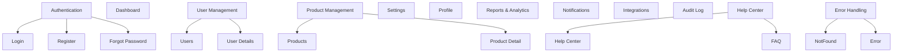

# 📚 Feature Pages & Component Flows

## 1. 🎯 Objective

Map out all feature pages and their component flows for an enterprise-grade frontend using ReactJS, Redux, TypeScript, MUI, and Atomic Design principles.  
Focus on extensibility, reusability, edge cases, and developer experience.

---

## 2. 🗂️ Feature Pages Overview

| Feature Name        | Page(s)                  | Description / Purpose                                                      |
|---------------------|-------------------------|----------------------------------------------------------------------------|
| Authentication      | Login, Register, Forgot | User sign in, registration, password reset flows                           |
| Dashboard           | Dashboard               | High-level metrics, widgets, activity, user-specific data                  |
| User Management     | Users, User Details     | List users, view user profiles, edit roles, manage permissions             |
| Product Management  | Products, Product Detail| Browse, filter, edit, and manage products                                  |
| Settings            | Settings                | Update user, app, and notification preferences                             |
| Profile             | Profile                 | View and edit personal information                                         |
| Reports & Analytics | Reports, Analytics      | Data visualization, export, filter, drill-down                             |
| Notifications       | Notifications           | View alerts, messages, actions                                             |
| Integrations        | Integrations            | Connect and manage external services/APIs                                  |
| Audit Log           | Audit Log               | Track key actions and changes for compliance                               |
| Help Center         | Help Center, FAQ        | User support, documentation, knowledge base                                |
| Error Handling      | NotFound, Error         | Display user-friendly messages for app and network errors                  |

---

## 3. 🧩 Component Flows per Page

### Authentication Flows

- **Login Page**
  - Atoms: Input, Button, Typography
  - Molecules: FormField, AlertMessage
  - Organisms: LoginForm
  - Templates: AuthLayout
  - Flow: Input credentials → Submit → Loading → Error/Success → Redirect

- **Register Page**
  - Atoms: Input, Button, Typography, Checkbox
  - Molecules: FormField
  - Organisms: RegisterForm
  - Templates: AuthLayout
  - Flow: Fill form → Validate → Submit → Error/Success → Login/Welcome

- **Forgot Password**
  - Atoms: Input, Button, Typography
  - Molecules: FormField
  - Organisms: ForgotPasswordForm
  - Templates: AuthLayout
  - Flow: Enter email → Submit → Email sent → Confirm → Back to Login

---

### Dashboard Flow

- **Dashboard Page**
  - Atoms: Card, Typography, Icon, Button
  - Molecules: StatsWidget, ActivityItem
  - Organisms: Header, Sidebar, DataTable, ChartWidget
  - Templates: DashboardLayout
  - Flow: View metrics → Interact with widgets → Filter data → Drill down → View details

---

### User Management Flows

- **Users Page**
  - Atoms: SearchInput, Button, Avatar
  - Molecules: SearchBar, UserCard
  - Organisms: UserTable, Pagination
  - Templates: DashboardLayout
  - Flow: List users → Search/filter → Select user → View/edit details

- **User Details Page**
  - Atoms: Input, Button, Badge
  - Molecules: FormField, RoleSelector
  - Organisms: EditUserForm, ActivityLog
  - Templates: DashboardLayout
  - Flow: View profile → Edit info/roles → Save changes → Error/Success

---

### Product Management Flows

- **Products Page**
  - Atoms: SearchInput, Button, Chip
  - Molecules: ProductCard, FilterBar
  - Organisms: ProductTable, Pagination
  - Templates: DashboardLayout
  - Flow: List products → Filter → Select product → View/edit details

- **Product Detail Page**
  - Atoms: Input, Button, Badge
  - Molecules: FormField, TagSelector
  - Organisms: EditProductForm, RelatedProducts
  - Templates: DashboardLayout
  - Flow: View/edit product → Manage tags/images → Save changes

---

### Settings Flow

- **Settings Page**
  - Atoms: Switch, Button, Typography
  - Molecules: SettingsField, NotificationToggle
  - Organisms: SettingsForm
  - Templates: DashboardLayout
  - Flow: Change preferences → Save/cancel → Error/Success

---

### Profile Flow

- **Profile Page**
  - Atoms: Avatar, Input, Button
  - Molecules: FormField, ProfileCard
  - Organisms: EditProfileForm, ActivityWidget
  - Templates: DashboardLayout
  - Flow: View/edit info → Upload avatar → Save changes

---

### Reports & Analytics Flow

- **Reports Page**
  - Atoms: DatePicker, Button, Typography
  - Molecules: FilterBar, ChartCard
  - Organisms: DataTable, ChartWidget
  - Templates: DashboardLayout
  - Flow: Select dates → Filter → View charts/tables → Export data

---

### Notifications Flow

- **Notifications Page**
  - Atoms: Icon, Badge, Button
  - Molecules: NotificationItem
  - Organisms: NotificationList
  - Templates: DashboardLayout
  - Flow: View alerts → Mark as read → Take action

---

### Integrations Flow

- **Integrations Page**
  - Atoms: Icon, Button, Typography
  - Molecules: IntegrationCard
  - Organisms: IntegrationList, AddIntegrationForm
  - Templates: DashboardLayout
  - Flow: List integrations → Connect/disconnect → Configure → Save

---

### Audit Log Flow

- **Audit Log Page**
  - Atoms: Typography, Badge
  - Molecules: AuditLogItem
  - Organisms: AuditLogTable
  - Templates: DashboardLayout
  - Flow: View logs → Filter by date/user/action → Drill down

---

### Help Center Flow

- **Help Center Page**
  - Atoms: SearchInput, Typography
  - Molecules: FAQItem
  - Organisms: FAQList, ContactForm
  - Templates: PublicLayout
  - Flow: Search help topics → Read answers → Contact support

---

### Error Handling Flows

- **NotFound Page**
  - Atoms: Typography, Button
  - Organisms: ErrorMessage
  - Templates: ErrorLayout
  - Flow: Display 404 → Suggest navigation → Redirect

- **Error Page**
  - Atoms: Typography, Button
  - Organisms: ErrorMessage
  - Templates: ErrorLayout
  - Flow: Display error → Provide action → Retry/Redirect

---

## 4. 🔄 Edge Case Mapping

| Flow            | Edge Case Example                         |
|-----------------|-------------------------------------------|
| Login           | Invalid credentials, network error        |
| Dashboard       | No data, API error, slow load             |
| User Edit       | Permission denied, validation error       |
| Product Save    | Duplicate SKU, image upload fail          |
| Settings        | Save fail, revert changes                 |
| Notifications   | No notifications, action failure          |
| Integrations    | Connection timeout, auth error            |
| Audit Log       | Large data, filter mismatch               |
| Help Center     | No results, contact form error            |
| Error Page      | Infinite redirect, broken link            |

---

## 5. 📐 Visual Overview (Mermaid Diagram)

---

## 6. 📝 Developer Experience Notes

- All flows strictly typed and documented.
- Mock data for each page and flow.
- Accessibility and error handling built in.
- Atomic structure ensures reusability and rapid iteration.

---