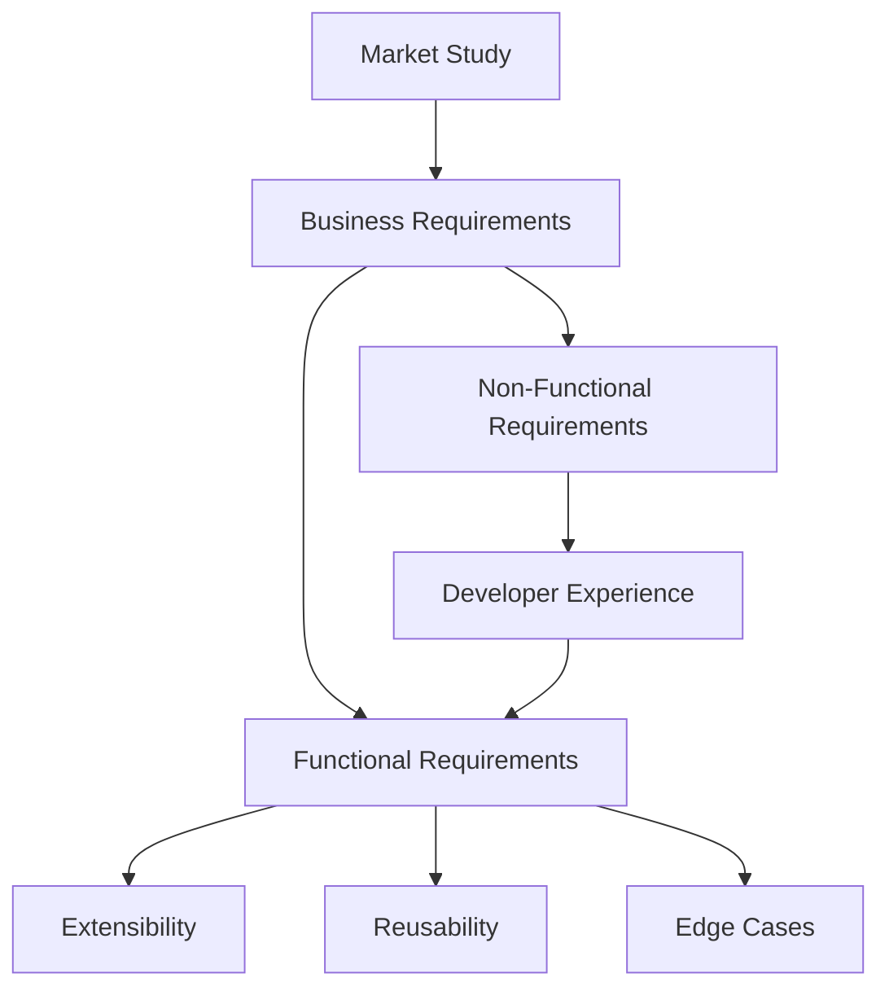

# 🧠 Next Step: Structured Analysis Before Coding

## 1. 📋 Requirements Mapping

### a. **Business Requirements**
- What are the core business goals for the application?
- Which user types/personas will interact with the system?
- What are the essential features for MVP vs. future roadmap?

### b. **Functional Requirements**
- List all major modules (e.g., Authentication, Dashboard, User Management, Settings, etc.)
- Define user flows for each page (entry, success, error, edge cases)
- Map data entities and relationships

### c. **Non-Functional Requirements**
- Performance targets (load speed, responsiveness)
- Accessibility (WCAG compliance, keyboard navigation, ARIA)
- Internationalization/localization needs
- Security (input validation, XSS/CSRF protection, auth flows)
- Scalability (projected user volume, data growth)

---

## 2. 🏗️ Extensibility & Reusability

- **Atomic Design**: Decompose UI into Atoms, Molecules, Organisms, Templates, Pages
    - Ensure every component is reusable and composable by design
- **Feature-Based Directory Structure**: Each feature is a self-contained module
- **Centralized State Management**: Use Redux Toolkit, RTK Query for scalable state and data fetching
- **Custom Hooks**: Isolation of logic for reuse and testability

---

## 3. 📑 Edge Case Identification

| Module         | Edge Cases Example                       |
|----------------|-----------------------------------------|
| Auth           | Invalid credentials, locked account, token expiry, password reset fail |
| Dashboard      | No data, slow API, permission denied, filter mismatch |
| Profile        | Avatar upload error, invalid details, unsaved changes |
| Settings       | Invalid config, revert changes, save fail |
| Data Table     | Empty state, pagination edge, sorting error, bulk actions error |

---

## 4. 📊 Market Study & Open Source Justification

- **ReactJS/Redux/TypeScript/MUI**: Most adopted open-source stack for scalable web apps
- **Atomic Design**: Industry standard for maintainable UI systems
- **Open Source Strategy**: Reduces vendor lock-in, increases community support, lowers TCO
- **Competitive Analysis**: Identify similar platforms (e.g., Segment, Auth0, Airtable UI) and highlight differentiation

---

## 5. 🧩 Developer Experience

- **Documentation**: README.md, COMPONENTS.md, FLOWCHARTS.md for onboarding
- **Tooling**: ESLint, Prettier, Storybook, Jest for quality and velocity
- **Sample Flows**: Example user journeys, edge-case handling, mock data usage

---

## 6. 📐 Visual Mapping (Mermaid Diagram)

---

## 7. 🚦 Decision Gates Before Coding

- Is every flow and edge case mapped for each page/module?
- Are business and functional requirements fully understood?
- Is the directory structure extensible for future features?
- Is there a clear plan for documentation and onboarding?
- Are the open source choices justified for long-term maintenance?