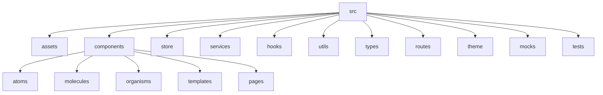

# 🚀 Full Frontend Directory Structure (ReactJS, Redux, TypeScript, MUI, Atomic Design)

## 1. 📁 Root Structure

```
src/
├── assets/
│   ├── images/
│   ├── fonts/
│   └── styles/
├── components/
│   ├── atoms/
│   ├── molecules/
│   ├── organisms/
│   ├── templates/
│   └── pages/
├── store/
│   ├── slices/
│   └── middleware/
├── services/
│   └── api/
├── hooks/
├── utils/
├── types/
├── routes/
├── theme/
├── mocks/
└── tests/
```

---

## 2. 🧩 Atomic Components (Detailed)

### 2.1 Atoms (`src/components/atoms`)
- Button/
  - Button.tsx
  - Button.styles.ts
  - Button.types.ts
  - Button.test.tsx
  - Button.stories.tsx
  - index.ts
- Input/
  - Input.tsx
  - Input.styles.ts
  - Input.types.ts
  - Input.test.tsx
  - Input.stories.tsx
  - index.ts
- Typography/
  - Typography.tsx
  - Typography.styles.ts
  - Typography.types.ts
  - Typography.test.tsx
  - Typography.stories.tsx
  - index.ts
- Divider/
- Icon/
- Loader/
- Badge/
- Chip/

### 2.2 Molecules (`src/components/molecules`)
- FormField/
  - FormField.tsx
  - FormField.types.ts
  - FormField.test.tsx
  - FormField.stories.tsx
  - index.ts
- SearchBar/
- CardHeader/
- NavItem/
- AlertMessage/
- ModalHeader/

### 2.3 Organisms (`src/components/organisms`)
- Header/
- Sidebar/
- DataTable/
- LoginForm/
- UserMenu/
- Footer/

### 2.4 Templates (`src/components/templates`)
- DashboardLayout/
- AuthLayout/
- PublicLayout/
- ErrorLayout/

### 2.5 Pages (`src/components/pages`)
- Home/
- Login/
- Register/
- Dashboard/
- Profile/
- Settings/
- Users/
- Products/
- NotFound/

---

## 3. 🌐 Routing (`src/routes`)
- index.tsx            # Main Router
- PrivateRoute.tsx     # Protected Route Wrapper
- PublicRoute.tsx      # Public Route Wrapper
- routeConfig.ts       # Route Definitions

---

## 4. 🏪 Redux Store (`src/store`)
- index.ts             # Store Config
- rootReducer.ts
- slices/
  - auth/
    - authSlice.ts
    - authSelectors.ts
    - authThunks.ts
    - authTypes.ts
    - authApi.ts
  - user/
    - userSlice.ts
    - userSelectors.ts
    - userThunks.ts
  - ui/
    - uiSlice.ts
    - uiSelectors.ts
    - uiThunks.ts
  - api/
    - apiSlice.ts
    - apiTypes.ts
- middleware/
  - logger.ts
  - errorHandler.ts

---

## 5. 🛠 Services (`src/services`)
- api/
  - client.ts           # Axios instance
  - endpoints/
    - auth.ts
    - users.ts
    - products.ts
  - interceptors/
    - authInterceptor.ts
    - errorInterceptor.ts
- storage/
- analytics/
- websocket/

---

## 6. 🔗 Hooks (`src/hooks`)
- useAuth.ts
- useApi.ts
- useDebounce.ts
- useLocalStorage.ts
- usePagination.ts
- useWebSocket.ts

---

## 7. ⚙️ Utilities (`src/utils`)
- constants/
  - routes.ts
  - api.ts
  - config.ts
- helpers/
  - date.ts
  - validation.ts
  - format.ts
- validators/
- formatters/

---

## 8. 📐 Types (`src/types`)
- models/
  - User.ts
  - Product.ts
  - Order.ts
- api/
- store/
- common/

---

## 9. 🎨 Theme (`src/theme`)
- index.ts
- palette.ts
- typography.ts
- components/
- breakpoints.ts

---

## 10. 🧪 Mocks (`src/mocks`)
- data/
  - users.ts
  - products.ts
  - orders.ts
- handlers/
- browser.ts

---

## 11. 🧾 Tests (`src/tests`)
- setup.ts
- utils/
- fixtures/

---

## 12. 🏷️ Entry Files
- App.tsx
- index.tsx
- vite-env.d.ts

---

## 13. 📝 Example Page Directory (`src/components/pages/Dashboard`)
```
Dashboard/
├── Dashboard.tsx
├── Dashboard.test.tsx
├── Dashboard.stories.tsx
├── Dashboard.types.ts
├── Dashboard.styles.ts
├── Dashboard.utils.ts
├── widgets/
│   ├── StatsWidget.tsx
│   ├── ChartWidget.tsx
│   └── ActivityWidget.tsx
├── index.ts
```

---

## 14. 🗂️ Example Component Directory (`src/components/atoms/Button`)
```
Button/
├── Button.tsx
├── Button.styles.ts
├── Button.types.ts
├── Button.test.tsx
├── Button.stories.tsx
├── index.ts
```

---

## 15. 🛡️ Best Practices

- **Colocation**: Related files grouped together
- **Barrel Exports**: Use `index.ts` for clean imports
- **Type Safety**: All props and state typed
- **Testing**: Unit tests alongside implementation
- **Documentation**: JSDoc and markdown where needed
- **Accessibility**: ARIA, keyboard navigation
- **Lazy Loading**: Pages and heavy components

---

## 16. 🟢 Expansion Pattern

- Add new features in `components/pages/FeatureName`
- Add new slices in `store/slices/featureName`
- Add new endpoints in `services/api/endpoints/featureName.ts`
- Add new hooks in `hooks/useFeatureName.ts`

---

## 17. 🧬 Atomic Design Summary

- **Atoms**: Buttons, Inputs, Typography, etc.
- **Molecules**: FormFields, SearchBar, etc.
- **Organisms**: Header, Sidebar, Forms, etc.
- **Templates**: Layouts
- **Pages**: Full page views

---

## 18. 🎯 Directory Structure Diagram (Mermaid)



---