```mermaid
graph TD
    A[Authentication]
    B[Dashboard]
    C[User Management]
    D[Product Management]
    E[Settings]
    F[Reports & Analytics]
    G[Notifications]
    H[Integrations]
    I[Audit Log]
    J[Help Center]
    K[Error Handling]
    L[Billing & Subscription]
    M[Multi-Tenancy]
    N[Activity Feed]

    A --> A1[Login]
    A --> A2[Register]
    A --> A3[Forgot Password]
    A --> A4[MFA]
    A --> A5[SSO]

    B --> B1[Dashboard]
    B --> B2[Analytics Overview]
    B --> B3[Custom Widgets]

    C --> C1[Users List]
    C --> C2[User Details]
    C --> C3[Edit User]
    C --> C4[Role Management]

    D --> D1[Products]
    D --> D2[Product Detail]
    D --> D3[Create/Edit Product]

    E --> E1[General]
    E --> E2[Preferences]
    E --> E3[Notifications]
    E --> E4[Security]

    F --> F1[Reports]
    F --> F2[Analytics Builder]
    F --> F3[Export]
    F --> F4[Trends]

    G --> G1[Inbox]
    G --> G2[Alerts]
    G --> G3[Messages]
    G --> G4[Action Center]

    H --> H1[Integrations]
    H --> H2[Add Integration]
    H --> H3[Edit Settings]

    I --> I1[Audit Log]
    I --> I2[Log Detail]

    J --> J1[Help Center]
    J --> J2[FAQ]
    J --> J3[Contact Support]
    J --> J4[Guides]

    K --> K1[NotFound]
    K --> K2[Error]
    K --> K3[Maintenance]
    K --> K4[Permission Denied]

    L --> L1[Plans]
    L --> L2[Payment Methods]
    L --> L3[Invoices]
    L --> L4[History]

    M --> M1[Tenant List]
    M --> M2[Tenant Details]
    M --> M3[Switch Tenant]

    N --> N1[Activity Stream]
    N --> N2[Notifications]
```

# 🧠 MIT-Level Structured Flow & Edge Case Mapping

## 1. 🎯 Document Every Flow and Edge Case Before Coding

### Authentication Flows
- **Login**
  - Flow: Enter credentials → Submit → Loading → Authenticate → Redirect/Fail
  - Edge Cases: Invalid credentials, locked account, server error, network fail, rate limit, input validation, MFA required
- **Register**
  - Flow: Fill form → Validate → Submit → Confirm email → Success/Fail
  - Edge Cases: Duplicate email, weak password, invalid data, email not delivered, registration throttled
- **Forgot Password**
  - Flow: Enter email → Submit → Email sent → Reset link → Success/Fail
  - Edge Cases: Email not found, network fail, spam filter, expired token
- **Logout**
  - Flow: Click logout → Session end → Redirect to login
  - Edge Cases: Token revoke fail, UI not updated

### Dashboard Flows
- **Dashboard View**
  - Flow: Load metrics → Display widgets → Filter data → Drill down
  - Edge Cases: No data, slow API, API error, permission denied, widget config error
- **Custom Widget**
  - Flow: Add widget → Configure → Save → Display
  - Edge Cases: Invalid config, duplicate widget, render fail

### User Management Flows
- **User Listing**
  - Flow: Load users → Search/filter/paginate → Select user
  - Edge Cases: No users, search fail, pagination error, permission denied
- **User Detail**
  - Flow: View details → Edit → Save changes
  - Edge Cases: Invalid input, conflict update, permission denied, edit fail
- **Role Management**
  - Flow: Assign role → Save → Confirm
  - Edge Cases: Unauthorized change, role conflict, audit error

### Product Management Flows
- **Product Listing**
  - Flow: Load products → Filter/search → Sort/paginate → Select product
  - Edge Cases: No products, filter mismatch, API error, image load fail
- **Product Detail/Edit**
  - Flow: Edit fields → Save → Confirm
  - Edge Cases: Invalid SKU, duplicate product, save error, image upload fail

### Settings Flows
- **Update Preferences**
  - Flow: Change setting → Save → Feedback
  - Edge Cases: Save fail, revert changes, validation error, access denied

### Reports & Analytics Flows
- **View Report**
  - Flow: Select range → Load data → Display charts/tables → Export
  - Edge Cases: Large data, export fail, chart render error, empty result

### Notifications Flows
- **Notification Center**
  - Flow: Load notifications → Mark as read → Take action
  - Edge Cases: No notification, action fail, real-time update fail

### Integrations Flows
- **Manage Integrations**
  - Flow: List integrations → Add/Edit/Remove → Configure → Save
  - Edge Cases: API limit, OAuth error, provider unavailable, config conflict

### Audit Log Flows
- **View Audit Log**
  - Flow: Load logs → Filter → Drill down → Export
  - Edge Cases: Large logs, filter error, permission denied, export fail

### Help Center Flows
- **FAQ/Search**
  - Flow: Search topic → View answer → Contact support
  - Edge Cases: No result, contact fail, external link error

### Error Handling Flows
- **Error/404/Maintenance**
  - Flow: Display message → Suggest navigation/action → Retry/Redirect
  - Edge Cases: Infinite redirect, broken link, maintenance mode

---

## 2. 🧩 Atomic Component Design for Reuse

| Level       | Example Components                        | Reuse Contexts                    |
|-------------|-------------------------------------------|------------------------------------|
| Atoms       | Button, Input, Typography, Icon, Loader   | All forms, lists, cards, dialogs   |
| Molecules   | FormField, SearchBar, CardHeader, Tag     | Forms, tables, search/filter UIs   |
| Organisms   | Header, Sidebar, DataTable, Notification  | Layouts, dashboards, management    |
| Templates   | AuthLayout, DashboardLayout, ErrorLayout  | Page structures                    |
| Pages       | Home, Login, Profile, Settings, etc.      | Routed views                       |

- **Design Principle:** Every component is strictly typed, documented, and tested for edge cases.
- **Accessibility:** All components ARIA-compliant and keyboard-navigable.

---

## 3. 🏪 Redux Slice & State Mapping

| Domain         | Slice Name       | State Shape (Key Fields)                    | Business Flows Managed         |
|----------------|------------------|---------------------------------------------|-------------------------------|
| Auth           | authSlice        | {user, token, loading, error, mfaRequired}  | Login, logout, register, MFA  |
| User           | userSlice        | {users, selectedUser, loading, error}       | Listing, edit, roles          |
| UI State       | uiSlice          | {theme, notifications, modals, loading}     | Layout, alerts, dialogs       |
| Product        | productSlice     | {products, selectedProduct, filters, error} | Catalog, CRUD, analytics      |
| Analytics      | analyticsSlice   | {reports, charts, loading, error}           | Dashboard, export             |
| Settings       | settingsSlice    | {prefs, security, notification, error}      | Preferences, security         |
| Integration    | integrationSlice | {list, config, status, error}               | External APIs, configs        |
| Audit Log      | auditSlice       | {logs, filters, selectedLog, loading}       | Traceability, compliance      |

---

## 4. 🎲 Robust Mock Data & Error Testing

- **Mock Data Generators:** Use Faker.js, MSW for each domain (users, products, notifications, audit logs, reports).
- **Scenarios to Simulate:** Success, loading, empty, error, edge cases (bad data, permission denied, network fail).
- **API Mocks:** All endpoints support paginated data, error responses, and latency simulation.

---

## 5. 🛡️ Open Source Practices for Scalability

- **Strict TypeScript**: No `any`, enforced types everywhere.
- **Code Quality**: ESLint, Prettier, commit hooks, CI pipelines.
- **Testing**: Unit and integration tests colocated with components.
- **Documentation**: JSDoc, markdown files, Storybook for UI.
- **Accessibility**: WCAG and ARIA compliance by default.
- **Performance**: Lazy loading, memoization, code splitting.

---

## 6. 📐 Visual Flow Mapping

---

## 7. 📝 Summary Checklist

- [x] Flows & edge cases mapped for every page and feature
- [x] Atomic components planned for cross-feature reuse
- [x] Redux slices and state shapes for all business domains
- [x] Mock data and error scenarios outlined for robust testing
- [x] Best open source practices integrated for long-term scalability

---