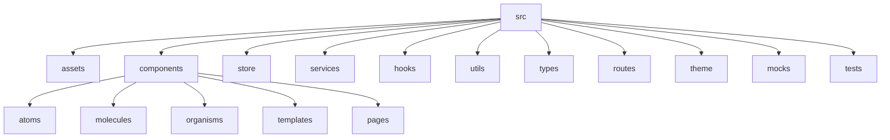
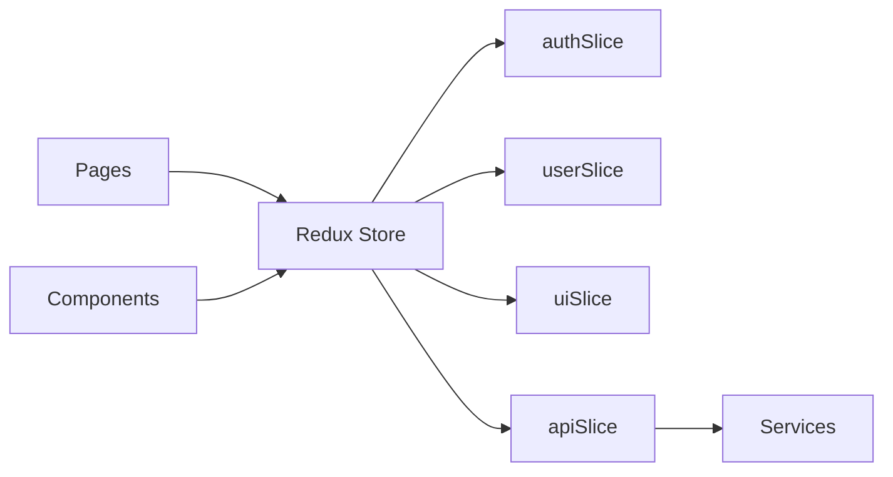

# 🚀 Next Steps: Structured Frontend Planning for Enterprise Application

## 1. 🎯 Objective

Design a scalable, maintainable, and high-performance frontend using ReactJS, Redux, TypeScript, MUI, and Atomic Design. Ensure the structure supports enterprise-grade features, rapid development, and easy onboarding for new contributors.

---

## 2. 🏗️ Directory Structure Vision

---

## 3. 🧩 Atomic Design Component Breakdown

| Level      | Examples                                               | Purpose                                         |
|------------|--------------------------------------------------------|-------------------------------------------------|
| Atoms      | Button, Input, Icon, Typography, Badge, Loader         | Smallest reusable UI units                      |
| Molecules  | FormField, SearchBar, CardHeader, NavItem, Alert       | Simple combinations of atoms                    |
| Organisms  | Header, Sidebar, DataTable, LoginForm, UserMenu        | Complex, functional UI blocks                   |
| Templates  | DashboardLayout, AuthLayout, PublicLayout, ErrorLayout | Layout structures for pages                     |
| Pages      | Home, Login, Register, Dashboard, Profile, Settings    | Full page views, routed components              |

---

## 4. 📄 Pages & Flows Mapping

| Page         | Key Components                              | User Flows                                       |
|--------------|---------------------------------------------|--------------------------------------------------|
| Home         | Hero, FeatureList, CTA, Footer              | Browse → Explore Features → Call-to-Action       |
| Login        | LoginForm, ErrorAlert, AuthLayout           | Enter Credentials → Submit → Redirect/Deny       |
| Register     | RegisterForm, SuccessModal, AuthLayout      | Fill Form → Submit → Confirm → Redirect          |
| Dashboard    | Header, Sidebar, StatsWidget, DataTable     | View Stats → Filter Data → Drill Down            |
| Profile      | UserCard, EditProfileForm, ActivityWidget   | View Profile → Edit → Save Changes               |
| Settings     | SettingsForm, NotificationToggle, ThemePicker| Update Preferences → Save → Feedback             |
| Users        | UserTable, SearchBar, UserDetailModal       | Search → Select User → View/Edit Details         |
| Products     | ProductTable, ProductCard, FilterBar        | List → Filter → View Details                     |
| NotFound     | ErrorMessage, GoHomeButton                  | Error → Redirect Home                            |

---

## 5. 🔗 State Management Flow (Redux)

---

## 6. 🧬 Mock Data Strategy

- **Purpose**: Enable development/testing without backend
- **Tools**: Faker.js, MSW (Mock Service Worker)
- **Areas Covered**: Users, Products, Orders, Notifications, Auth
- **Mock Flows**: 
  - User CRUD (Create, Read, Update, Delete)
  - Product listing & filtering
  - Auth states (logged in, logged out, error)
  - Loading, success, error states

---

## 7. 🛡️ Quality & Accessibility

- **Type Safety**: All components/interfaces strictly typed
- **Testing**: Colocated unit/integration tests
- **Accessibility**: ARIA attributes, keyboard navigation, color contrast
- **Performance**: Lazy loading, memoization, code splitting

---

## 8. 📚 Documentation & Onboarding

- **README.md**: Project overview, setup instructions
- **COMPONENTS.md**: Atomic structure reference
- **CONTRIBUTING.md**: Guidelines for contributors
- **FLOWCHARTS.md**: Visual flows for main user journeys

---

## 9. 🚦 Next Actions

1. **Finalize directory structure**
2. **List all atomic components required for each page**
3. **Map Redux slices to user flows**
4. **Outline mock data schema for rapid prototyping**
5. **Prepare onboarding documentation**

---

> **Think First:**  
Before coding, ensure all flows, edge cases, and requirements are mapped.  
Focus on extensibility, reusability, and developer experience.