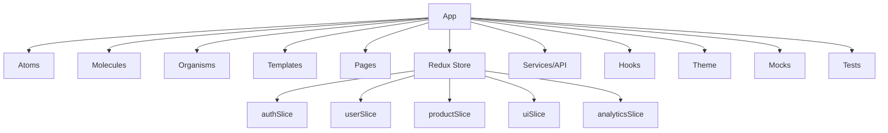

# 🚀 Frontend Development Kickoff Prompt

## 🎯 Objective

Initiate the development of a scalable, maintainable, and enterprise-ready frontend application using open source technologies: **ReactJS**, **Redux Toolkit**, **TypeScript**, **Material-UI (MUI)**, and **Atomic Design Structure**.

---

## 1. 📋 Requirements Analysis

- **Clarify business goals & user personas**
- **List core features for MVP and long-term roadmap**
- **Map user flows and edge cases for each feature**

---

## 2. 🏗️ Directory & Architecture Planning

- **Adopt Atomic Design:** Structure components into Atoms, Molecules, Organisms, Templates, Pages
- **Feature-Based Directory:** Organize code for scalability and separation of concerns
- **Centralized State Management:** Use Redux Toolkit and RTK Query for predictable state and data fetching
- **Theming:** Integrate MUI with custom theme and responsive breakpoints

---

## 3. 🧩 Component Strategy

- **Design reusable atomic components with strict TypeScript typing**
- **Document props, usage, and accessibility for each component**
- **Colocate tests, stories, and styles with component files**

---

## 4. 🏪 State & Data Flow Mapping

- **Define Redux slices for each business domain (auth, user, product, UI, analytics, etc.)**
- **Map state shapes and selectors for all features**
- **Plan for RTK Query endpoints and API integration**

---

## 5. 🎲 Mock Data & Error Case Preparation

- **Use Faker.js and MSW to generate mock data for development and testing**
- **Simulate all success, loading, error, and empty states for each flow**
- **Prepare scenarios for permission errors, network failures, and validation cases**

---

## 6. 🛡️ Quality, Accessibility & Best Practices

- **Enforce strict TypeScript, ESLint, Prettier, and testing standards**
- **Develop with accessibility (WCAG/ARIA) as a default**
- **Optimize for performance: lazy loading, memoization, code splitting**

---

## 7. 📚 Documentation & Onboarding

- **README.md:** Project overview, setup instructions
- **COMPONENTS.md:** Atomic structure reference
- **FLOWCHARTS.md:** Visual user flows and architecture diagrams
- **CONTRIBUTING.md:** Guidelines for new contributors

---

## 8. 🚦 Development Process

1. **Initialize repository with configuration files**
2. **Set up core directory structure**
3. **Develop foundation atomic components**
4. **Implement Redux store and slices**
5. **Set up routing and layouts**
6. **Build feature pages and flows**
7. **Test all components and flows with mock data**
8. **Document architecture, flows, and onboarding**

---

## 9. 📝 Example Prompt for Autonomous Development

```markdown
You are an expert frontend developer.  
Build a React 18+ application with TypeScript, Redux Toolkit, MUI, and Atomic Design structure.  
Create reusable atomic components, strict types, tests, stories, and mock data for all features and flows.  
Map Redux slices for each business domain.  
Simulate edge cases, error states, and accessibility.  
Follow best open source practices and document everything for rapid onboarding.
```

---

## 10. 📐 Mermaid Diagram: Architecture Overview



---

## ✅ Ready to Start

> **Think First:**  
> Review all mapped flows, edge cases, and requirements.  
> Prioritize extensibility, reusability, and developer experience.

---