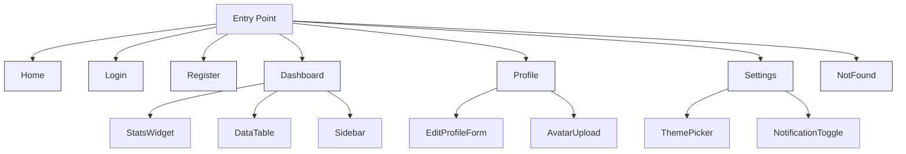

# 🧠 Think First: Structured Frontend Planning & Analysis

## 1. 🎯 Goals & Principles

- **Extensibility**: Architecture must easily support new features, modules, and integrations.
- **Reusability**: Components and logic should be reusable across pages and flows.
- **Developer Experience**: Clear structure, thorough documentation, and tooling for rapid development.
- **Open Source**: All choices favor community-supported technologies.

---

## 2. 🏗️ Flows & User Journeys

| Page/Module   | Primary Flows                                   | Edge Cases / Alternate Flows                           |
|---------------|-------------------------------------------------|--------------------------------------------------------|
| Home          | Landing → Feature highlight → CTA               | Feature missing, slow load, no CTA engagement          |
| Login         | Input creds → Submit → Success/Fail             | Wrong password, locked account, network error          |
| Register      | Fill form → Validate → Create user              | Duplicate email, weak password, validation error       |
| Dashboard     | View stats → Filter → Deep dive                 | No data, permission denied, slow API, invalid filters  |
| Profile       | View → Edit → Save                              | Invalid input, unsaved changes, avatar upload error    |
| Settings      | Change prefs → Save → Feedback                  | Invalid config, revert changes, access error           |
| NotFound      | 404 → Suggest navigation                        | Infinite redirect, broken link, user confusion         |

---

## 3. 🧩 Extensibility Patterns

- **Atomic Design**: Atoms → Molecules → Organisms → Templates → Pages.  
  Enables granular updates and scalable UI evolution.
- **Feature-based Slices**: Redux slices per domain (auth, user, settings, data).
- **Custom Hooks**: Isolate logic, enable sharing and testing.
- **Theme Customization**: MUI themes for easy branding and dark/light mode.

---

## 4. 🛡 Edge Case Handling

- **Network Failures**: Retry strategies, offline messaging, loading states.
- **Validation Errors**: Inline feedback, accessibility for screen readers.
- **Empty States**: Placeholder illustrations, onboarding hints.
- **Permission Issues**: Conditional rendering, error pages, audit logging.
- **Large Data**: Pagination, virtualized lists, skeleton loading.
- **Device/Viewport Variants**: Responsive layouts, mobile-first breakpoints.

---

## 5. 🔄 Reusability Strategy

- **Component Libraries**: All UI primitives standardized (MUI + custom atoms).
- **Utility Functions**: Centralized helpers for formatting, validation, etc.
- **Mock Data**: MSW + Faker for local development, demo, and testing.
- **State Selectors**: Memoized selectors for derived data across pages.
- **Barrel Exports**: Index files for clean imports and component discovery.

---

## 6. 👨‍💻 Developer Experience

- **Directory Structure**: Feature-based, atomic, and clear separation.
- **Tooling**: ESLint, Prettier, Storybook, Jest, React Testing Library.
- **Documentation**: README, COMPONENTS.md, FLOWCHARTS.md, inline JSDoc.
- **Onboarding**: Sample flows, guided walkthroughs, live demo with mock data.
- **Code Quality**: Strict TypeScript, linting, CI pipelines.

---

## 7. 📝 Next Steps

1. **Map all required pages, flows, and edge cases.**
2. **Design atomic components for maximum reusability.**
3. **Define Redux slices and state shape for each feature.**
4. **Outline mock data schemas for rapid prototyping.**
5. **Prepare onboarding and architectural documentation.**

---

## 8. 📈 Mermaid Diagram: Flow & Extensibility Overview

